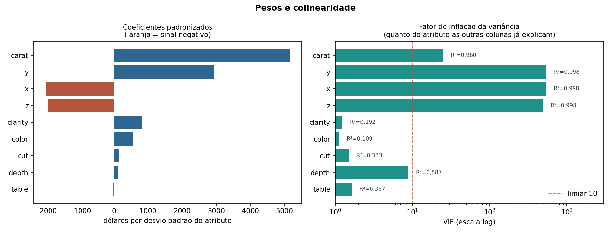
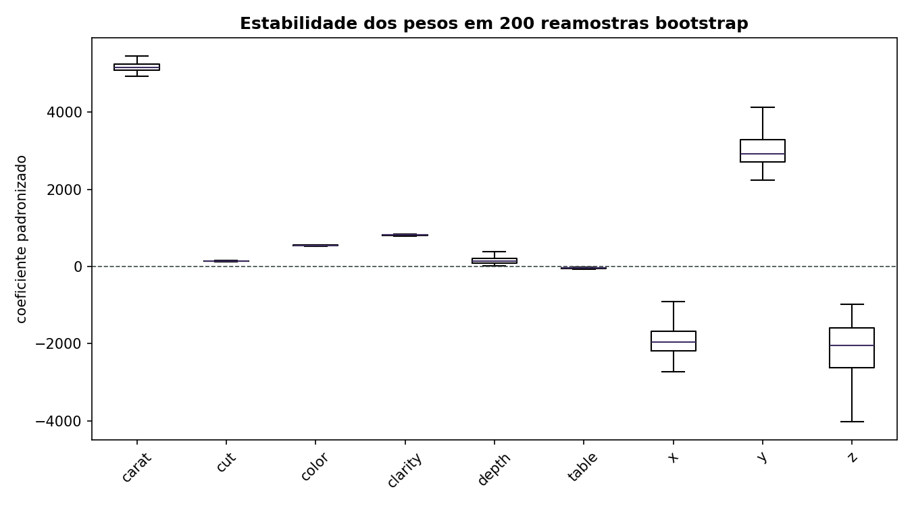
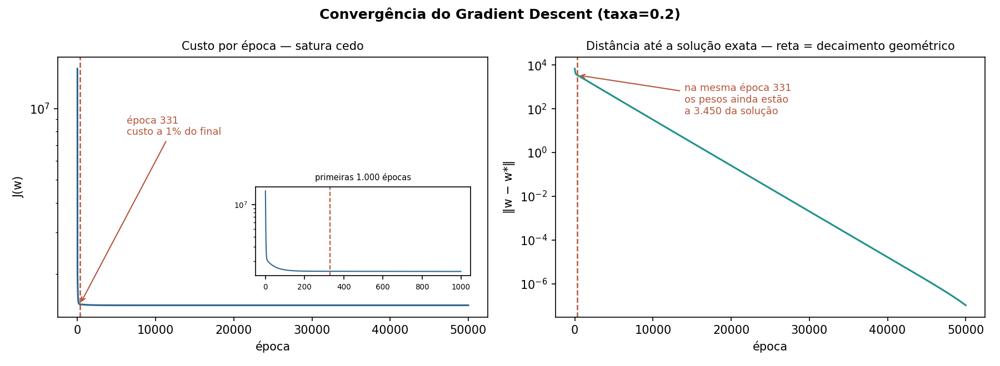
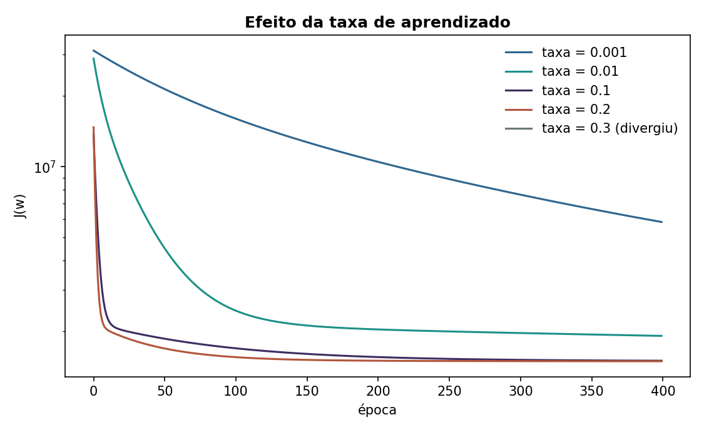
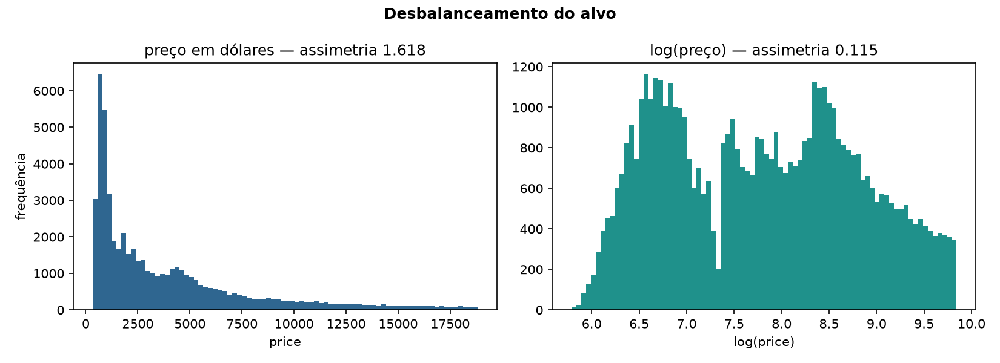
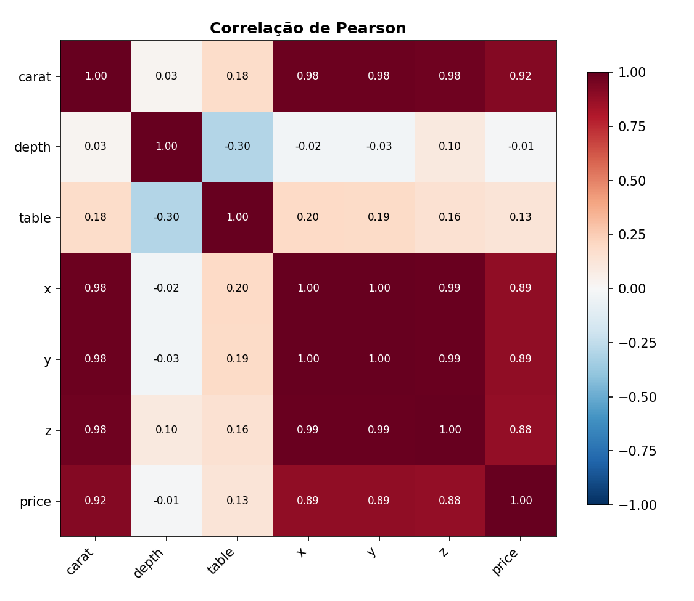
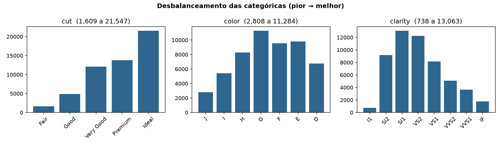
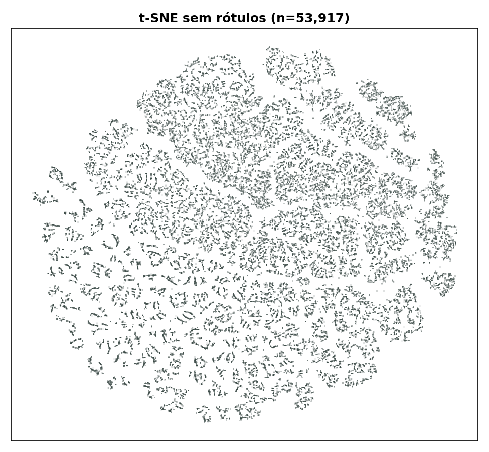
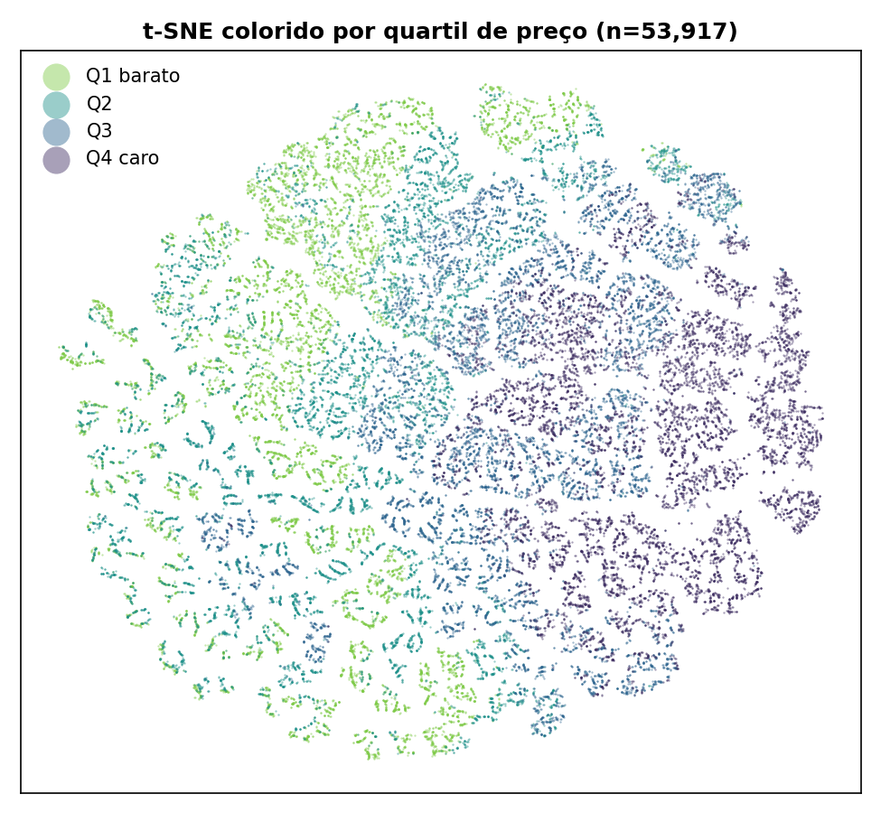

# Projeto 1 — Regressão
### Predição do preço de diamantes com Regressão Linear e Gradient Descent

**Disciplina:** Inteligência Artificial · **Data:** setembro de 2026

**Base:** `diamonds` — OpenML id 42225 · 53.917 instâncias após limpeza · 9 preditoras · alvo `price` em dólares

**Código:** implementações próprias das equações normais e do Gradient Descent em `src/modelos.py`,
sem uso de biblioteca de aprendizado de máquina nos modelos.

---

## 1. Introducao

Este trabalho trata de um problema de regressão: estimar o preço de venda de um diamante lapidado a partir de nove atributos que descrevem sua massa, sua geometria de lapidação e sua qualidade gemológica. O alvo é `price`, medido em dólares americanos, uma variável contínua que na base vai de 326 a 18.823 USD, com mediana de 2.401 e média de 3.930,91 — uma quantidade cujo erro é expresso na mesma unidade do preço, e não uma classe a ser rotulada. O modelo procurado tem a forma $\hat{y} = w_0 + \sum_{j=1}^{d} w_j x_j$, e dele se exige duas coisas ao mesmo tempo: acertar o preço de pedras que não estavam no treino e deixar visível, em cada $w_j$, quanto o mercado paga por um desvio padrão de cada característica (os atributos entram padronizados, com média e desvio estimados apenas no treino). As duas exigências não são automaticamente compatíveis nesta base, e boa parte das análises deste relatório existe justamente para medir essa tensão.

A base escolhida foi `diamonds`, com 53.917 instâncias após a limpeza — quase 27 vezes o mínimo de 2 mil pedido no enunciado — e nenhum valor faltante em nenhuma das dez colunas. Os atributos são estruturados e todos têm significado direto e verificável: `carat` é a massa em quilates; `x`, `y` e `z` são as dimensões da pedra em milímetros; `depth` e `table` são proporções percentuais da lapidação; e `cut`, `color` e `clarity` são escalas ordinais de qualidade usadas no comércio de gemas, com 5, 7 e 8 níveis respectivamente. Essa composição — seis atributos contínuos e três ordinais — permite comparar diretamente duas codificações das categóricas (inteiro na ordem de qualidade contra *one-hot*) dentro do mesmo experimento.

A base também foi escolhida porque não é bem comportada, e isso torna as análises pedidas substantivas em vez de protocolares. O preço correlaciona 0,922 com `carat`, o que garante que um modelo linear tenha o que aprender; mas `x`, `y` e `z` são praticamente redundantes entre si e com `carat` (correlação de 0,999 entre `x` e `y`, VIF de 537,2, 539,5 e 489,7), o que produz coeficientes de sinal contraintuitivo — `y` com $+2.922,12$ e `x` com $-2.007,21$ — e obriga a análise de pesos a distinguir importância real de instabilidade numérica. Além disso o alvo é fortemente assimétrico à direita (assimetria 1,618, que cai para 0,115 em escala logarítmica), o que justifica testar a regressão sobre $\log(price)$ como uma das configurações.

Os dados vêm do OpenML, dataset de identificador 42225 (relação `diamonds`), baixado em formato ARFF a partir de `https://openml.org/data/v1/download/21792853/diamonds.arff` em 10/09/2026 e convertido para CSV pelo script `arff_para_csv.py`, escrito para este projeto usando apenas a biblioteca padrão do Python. O parser de ARFF é próprio e preserva cada valor como o texto original do arquivo, de modo que o CSV reproduz o ARFF campo por campo sem reformatação de números. O script valida largura de linha, tipo numérico e pertinência aos níveis nominais declarados, e registra em `dados/diamonds_metadados.json` a URL de origem, a data de extração, a lista de atributos com seus níveis e as somas SHA-256 dos dois arquivos (`0bbef7a2…` para o ARFF e `0e716479…` para o CSV), de forma que qualquer resultado deste relatório possa ser rastreado até um arquivo de conteúdo verificável. O arquivo bruto tem 53.940 linhas; a limpeza descartou 20 registros com alguma dimensão igual a zero e 3 com dimensão acima de 20 mm — fisicamente impossíveis para pedras cujo máximo é 5,01 quilates — restando as 53.917 instâncias usadas em todo o trabalho, divididas em 43.134 de treino e 10.783 de teste com 20% de reserva e semente 42.

O trabalho entrega implementações próprias dos dois algoritmos pedidos, em `src/modelos.py`, com módulos de treino e de predição separados e sem uso de scikit-learn no núcleo: a solução exata por equações normais, $A^{\top}Aw = A^{\top}y$, e a descida de gradiente sobre o custo $J(w) = \frac{1}{n}\lVert Aw - y\rVert^{2}$. Os dois são ajustados nas quatro configurações do cruzamento entre codificação (ordinal, *one-hot*) e escala do alvo (USD, log), totalizando oito ajustes avaliados por $R^2$ e MSE. Sobre isso, o relatório traz o estudo introdutório da base com correlação, desbalanceamento e análise visual de clusterização por t-SNE, a análise dos pesos com VIF e desvio em 200 reamostras bootstrap, a comparação de desempenho entre os dois métodos e o estudo da trajetória dos parâmetros da descida de gradiente — incluindo o ponto a partir do qual eles deixam de se alterar. Nove figuras (`01_distribuicao_alvo.png` a `09_taxa_aprendizado.png`) documentam cada uma dessas etapas. Como referência antecipada dos resultados: a melhor configuração, *one-hot* com alvo em log, alcança $R^2 = 0{,}9599$ e MSE de 628.051,98 USD² no conjunto de teste (RMSE de 792,50 USD), e a descida de gradiente reproduz a solução exata — na configuração ordinal em dólares, com taxa 0,2 e 50.000 épocas, a distância final entre os dois vetores de peso é de $1{,}02 \times 10^{-7}$.

---

## 2. Descricao do projeto

### 2.1 Base de dados e atributos

A base usada é a `diamonds`, obtida do OpenML sob o id 42225 em formato ARFF e convertida para `dados/diamonds.csv`. São 53.940 registros no arquivo original, cada linha uma pedra lapidada, com 10 atributos e nenhum valor faltante. O volume atende com folga o mínimo de 2 mil instâncias do enunciado, e todos os atributos são estruturados: seis numéricos contínuos e três categóricos ordinais, além do alvo.

O alvo é `price`, o preço de venda em dólares americanos. A tarefa é, portanto, regressão: prever um valor contínuo a partir das características físicas e de qualidade da pedra.

| Atributo | Tipo | Domínio observado | Significado |
|---|---|---|---|
| `carat` | numérico | 0,2 a 5,01 | Massa da pedra em quilates (1 ct = 0,2 g). É a medida de tamanho usada no mercado. |
| `cut` | categórico ordinal | 5 níveis: Fair, Good, Very Good, Premium, Ideal | Qualidade da lapidação, isto é, quão bem as facetas foram proporcionadas e polidas. Afeta o brilho, não o tamanho. |
| `color` | categórico ordinal | 7 níveis: J a D | Grau de ausência de cor. Na escala GIA, D é incolor (melhor) e J é o mais amarelado dentro da faixa presente na base. |
| `clarity` | categórico ordinal | 8 níveis: I1, SI2, SI1, VS2, VS1, VVS2, VVS1, IF | Grau de pureza, medido pelo tamanho e pela quantidade de inclusões internas. I1 é o pior, IF (*internally flawless*) o melhor. |
| `depth` | numérico | 43,0 a 79,0 (média 61,75) | Profundidade total percentual: $100 \cdot z / \overline{(x,y)}$. Mede a proporção da pedra, não o tamanho. |
| `table` | numérico | 43,0 a 95,0 (média 57,46) | Largura da mesa (faceta superior plana) como percentual do diâmetro maior. Também é uma razão de proporção. |
| **`price`** | **numérico — ALVO** | **326 a 18.823 USD** | **Preço de venda em dólares. É a variável a ser prevista.** |
| `x` | numérico | 3,73 a 10,74 | Comprimento em milímetros. |
| `y` | numérico | 3,68 a 10,54 | Largura em milímetros. |
| `z` | numérico | 1,07 a 6,98 | Altura em milímetros. |

Há uma redundância estrutural evidente já na leitura da tabela: `carat` é massa, e massa de um sólido é aproximadamente proporcional a $x \cdot y \cdot z$. Os quatro atributos medem a mesma coisa — o tamanho da pedra — por caminhos diferentes. Isso vira o problema central da análise dos pesos (seção 5.1) e não é corrigido no pré-processamento, porque o enunciado pede justamente que os modelos sejam avaliados como estão.

### 2.2 Limpeza

O único tratamento aplicado é a remoção de linhas com dimensões fisicamente impossíveis, implementado em `limpar()` (`src/dados.py`). Dois critérios, aplicados sobre `x`, `y` e `z`:

- **Dimensão igual a zero.** Uma pedra existente e pesada não pode ter 0 mm de comprimento, largura ou altura. Zero aqui é código de ausência de medida, não uma medida. São 20 linhas.
- **Dimensão acima de 20 mm.** Nenhuma pedra da base passa de 5,01 quilates; uma pedra desse peso não chega perto de 20 mm em qualquer eixo. Valores acima desse limite (`LIMITE_MM = 20.0`) são erro de digitação — tipicamente uma casa decimal deslocada. São 3 linhas.

Ao todo 23 linhas descartadas (os dois critérios não se sobrepõem), restando **53.917** instâncias. A perda é de 0,04% da base, então nenhuma decisão de modelagem depende dela; o motivo de remover é que esses pontos são alavancas em uma regressão por mínimos quadrados — um valor fora de escala em colunas cujos máximos legítimos são 10,74 mm (`x`), 10,54 mm (`y`) e 6,98 mm (`z`) arrasta o coeficiente de forma desproporcional. Não foi removido nenhum outro ponto: não há tratamento de outliers de preço, nem imputação (não há faltantes), nem filtro por faixa de `depth` ou `table`, mesmo com `table` chegando a 95. O relatório da limpeza é gravado em `resultados/limpeza.csv`.

### 2.3 Codificação das categóricas ordinais

`cut`, `color` e `clarity` são ordinais: seus níveis têm uma ordem de qualidade bem definida. Essa ordem está declarada explicitamente no dicionário `ORDEM` de `src/dados.py`:

$$\text{cut: Fair} < \text{Good} < \text{Very Good} < \text{Premium} < \text{Ideal}$$
$$\text{color: J} < \text{I} < \text{H} < \text{G} < \text{F} < \text{E} < \text{D}$$
$$\text{clarity: I1} < \text{SI2} < \text{SI1} < \text{VS2} < \text{VS1} < \text{VVS2} < \text{VVS1} < \text{IF}$$

**A ordem de qualidade não é a ordem em que os níveis aparecem no arquivo ARFF.** O ARFF lista os níveis em ordem alfabética, e qualquer rotina que apenas tome os códigos na ordem do arquivo produz uma codificação errada:

- Em `color`, a ordem alfabética é D, E, F, G, H, I, J — exatamente a ordem de qualidade **invertida**, porque a escala GIA nomeia o melhor grau com a letra mais próxima do início do alfabeto. Codificar assim inverte o sinal do coeficiente de `color`: o modelo passa a dizer que mais cor amarelada aumenta o preço.
- Em `cut`, a ordem alfabética é Fair, Good, Ideal, Premium, Very Good. Não é inversa nem crescente: embaralha a escala, jogando o melhor nível (Ideal) para o meio. O coeficiente resultante não tem interpretação.
- Em `clarity`, a ordenação alfabética (I1, IF, SI1, SI2, VS1, VS2, VVS1, VVS2) também não corresponde à escala de pureza, que vai de I1 a IF.

A função `codificar_ordinal()` resolve isso construindo um `pd.Categorical` com `categories` fixado na ordem de qualidade e tomando os códigos resultantes, de modo que 0 é sempre o pior nível. Há uma verificação explícita: se algum valor da coluna não estiver na lista declarada, o código levanta `ValueError` com os valores desconhecidos, em vez de deixar passar um código $-1$ silencioso.

Foram testadas **duas codificações**, e a comparação entre elas é um dos resultados da seção 4.2:

1. **Ordinal** — um inteiro por atributo, na ordem de qualidade. Total de **9 preditoras**. Impõe ao modelo a hipótese de que os degraus entre níveis consecutivos são iguais: passar de SI2 para SI1 vale o mesmo que passar de VVS1 para IF.
2. **One-hot** — uma coluna binária por nível, com `descartar_primeira=True` em `codificar_onehot()`, repassado ao `drop_first` de `pd.get_dummies`. Total de **23 preditoras**. O nível de pior qualidade de cada atributo (Fair, J, I1) vira a categoria de referência e é absorvido pelo intercepto; sem esse descarte, as colunas de um mesmo atributo somariam exatamente 1 em toda linha e seriam exatamente colineares com o intercepto, tornando $A^\top A$ singular. Essa codificação não assume degraus iguais — paga com 14 parâmetros a mais a liberdade de estimar o valor de cada nível separadamente.

### 2.4 Divisão treino/teste e padronização

A divisão é aleatória, 80% treino e 20% teste, com semente fixa 42 (`dividir()`): **43.134** instâncias de treino e **10.783** de teste. A base não é temporal nem agrupada — cada linha é uma pedra independente, sem repetição de indivíduo entre linhas — então embaralhar e cortar é apropriado; não há necessidade de divisão estratificada nem de respeitar ordem cronológica. A semente fixa garante que as quatro configurações de dados e os dois algoritmos vejam exatamente a mesma partição, o que é condição para que a comparação entre linhas da tabela de métricas signifique algo.

Os atributos são padronizados pela classe `Padronizador`:

$$z_{ij} = \frac{x_{ij} - \mu_j}{\sigma_j}$$

O ponto metodológico é **de onde vêm $\mu_j$ e $\sigma_j$**: o método `ajustar()` é chamado apenas com `X[treino]`, e o mesmo par ($\mu$, $\sigma$) é depois aplicado ao teste por `transformar()`. Calcular média e desvio sobre a base completa seria vazamento de informação (*data leakage*): as estatísticas do conjunto de teste entrariam na transformação aplicada ao treino, o modelo treinaria sobre dados que já carregam informação de pontos que ele deveria nunca ter visto, e a métrica de teste deixaria de estimar o erro em dados novos — ela ficaria otimista. Em produção o mesmo raciocínio vale de forma mais óbvia: na hora de prever o preço de uma pedra nova não existe "a média do conjunto", só a média congelada no treino. Colunas de desvio zero recebem divisor 1,0 em vez de gerar divisão por zero — situação que ocorre em princípio nas colunas binárias do one-hot, embora nenhum nível da base seja constante.

A padronização não é exigida pelas equações normais, que são invariantes a reescalonamento afim das colunas. Ela é necessária para o Gradient Descent: com `carat` em torno de 0,80 e `depth` em torno de 61,75, a matriz $A^\top A$ fica com autovalores separados por várias ordens de grandeza e nenhuma taxa de aprendizado única serve para todas as direções. Como efeito colateral útil, com as colunas na mesma escala os coeficientes passam a ser diretamente comparáveis entre si — o que é o que permite a análise de pesos da seção 5.1.

O alvo tem um tratamento próprio. A distribuição de `price` é assimétrica à direita, com assimetria 1,618, média 3.930,91 USD contra mediana 2.401,00 USD. O parâmetro `alvo_em_log` de `preparar()` permite treinar sobre $\log(\text{price})$, cuja assimetria cai para 0,115. Combinando as duas codificações com as duas escalas de alvo, temos as **quatro configurações** de dados avaliadas, cada uma treinada pelos dois algoritmos — oito ajustes no total.

### 2.5 Algoritmos implementados

Os dois algoritmos estão em `src/modelos.py`, **implementados do zero sobre NumPy**. Nenhuma função de modelagem do scikit-learn foi usada: não há `LinearRegression`, `SGDRegressor`, `StandardScaler` nem `train_test_split` no projeto. O scikit-learn entra em um único lugar, a `TSNE` do estudo exploratório (seção 3), que é ferramenta de visualização e não participa do treino nem da predição. As métricas também são implementadas à mão, em `src/metricas.py`.

Cada algoritmo é uma classe com **treino e predição como módulos separados**, conforme o enunciado: `treinar(X, y)` estima e guarda o vetor de pesos em `w_`, e `prever(X)` usa apenas `w_` para produzir previsões — pode ser chamado quantas vezes se queira, em qualquer matriz com o mesmo número de colunas, e levanta `RuntimeError` se for chamado antes do treino. Ambos operam sobre $A$, a matriz de atributos padronizados com uma coluna de uns acrescentada à frente por `_com_intercepto()`, de modo que $w_0$ é o intercepto e $w_1, \dots, w_d$ são os coeficientes. A validação `_conferir()` rejeita `NaN`, infinito e incompatibilidade de número de linhas antes de qualquer conta.

**`RegressaoLinearFechada` — equações normais.** Minimizar o erro quadrático leva à condição de primeira ordem

$$A^\top A\, w = A^\top y \quad \Longrightarrow \quad w = (A^\top A)^{-1} A^\top y$$

A implementação resolve o sistema linear com `np.linalg.solve(A.T @ A, A.T @ y)` em vez de formar a inversa explicitamente com `np.linalg.inv`: resolver é mais estável numericamente e mais rápido, e inverter uma matriz apenas para multiplicá-la por um vetor é trabalho desperdiçado. Esta é a solução exata e serve de gabarito para o Gradient Descent.

**`RegressaoLinearGD` — Gradient Descent.** Minimiza o mesmo custo, o erro quadrático médio

$$J(w) = \frac{1}{n}\lVert Aw - y\rVert^2$$

cujo gradiente é

$$\nabla J(w) = \frac{2}{n} A^\top (Aw - y)$$

e itera o passo de descida

$$w \leftarrow w - \eta\, \nabla J(w)$$

com taxa de aprendizado $\eta$ constante. Detalhes da implementação:

- Inicialização em $w = 0$, não aleatória. $J$ é convexo e quadrático, então o ponto de partida não altera o mínimo encontrado, só o caminho; partir de zero torna o histórico reprodutível.
- Gradiente **completo** (*batch*), calculado sobre as 43.134 linhas de treino a cada época. Não é estocástico nem por mini-lote.
- Configuração usada nos experimentos, que é o padrão de linha de comando de `02_treino.py` e `03_analises.py`: $\eta = 0{,}2$, limite de 50.000 épocas, tolerância $10^{-10}$ sobre $\lVert \nabla J \rVert$ como critério de parada antecipada. Os padrões da própria classe `RegressaoLinearGD` são mais conservadores, $\eta = 0{,}1$ e 2.000 épocas, e não foram usados nos resultados reportados.
- **Guarda contra divergência.** Como o custo de um problema convexo quadrático deve cair monotonicamente a partir de $w=0$, qualquer época cujo custo supere o custo inicial indica que $\eta$ passou do limite estável $2/\lambda_{\max}$, sendo $\lambda_{\max}$ o maior autovalor da hessiana; o código levanta `FloatingPointError` nomeando a época, em vez de rodar 50.000 iterações até virar `NaN`.
- **Histórico por época** de custo, norma do gradiente e vetor de pesos completo. É esse histórico que alimenta as figuras `08_convergencia.png` e `09_taxa_aprendizado.png` e a resposta à pergunta do enunciado sobre o ponto em que os parâmetros param de mudar.

Quatro funções de diagnóstico completam o módulo, usadas na análise dos pesos e da convergência: `espectro(X)` devolve os autovalores da hessiana $H = \frac{2}{n}A^\top A$, e daí o número de condição $\kappa = \lambda_{\max}/\lambda_{\min}$ e a taxa máxima estável $2/\lambda_{\max}$; `vif(X)` calcula $\mathrm{VIF}_j = 1/(1-R^2_j)$ regredindo cada coluna contra as demais; e `pesos_por_reamostragem()` reajusta a solução exata em 200 amostras bootstrap para medir a dispersão de cada coeficiente. A quarta, `distancia_ate_a_solucao_exata()`, compara, época por época, $\lVert w^{(t)} - w^\star \rVert$ entre o Gradient Descent e as equações normais — na configuração ordinal/USD essa distância termina em $1{,}02 \times 10^{-7}$, o que confirma que os dois algoritmos resolvem o mesmo problema e chegam ao mesmo ponto.

### 2.6 Métricas de avaliação

A avaliação usa as duas métricas pedidas pelo enunciado, implementadas em `src/metricas.py`:

$$\mathrm{MSE} = \frac{1}{n}\sum_{i=1}^{n}\left(y_i - \hat{y}_i\right)^2
\qquad
R^2 = 1 - \frac{\sum_{i}\left(y_i - \hat{y}_i\right)^2}{\sum_{i}\left(y_i - \bar{y}\right)^2}$$

O MSE está em dólares ao quadrado, o que é difícil de interpretar; por isso a tabela de resultados também traz o $\mathrm{RMSE} = \sqrt{\mathrm{MSE}}$, que está na unidade do alvo e pode ser lido como erro típico em dólares. O $R^2$ é adimensional e mede a fração da variância do alvo explicada pelo modelo, usando como referência a média do **próprio conjunto avaliado** — valor negativo é resultado válido e significa modelo pior que prever a média constante, não erro de conta.

Um cuidado é decisivo para que a tabela comparativa faça sentido: **quando o alvo é treinado em log, as previsões voltam para dólares antes de qualquer medição**. A função `medir()` em `02_treino.py` verifica a flag `alvo_em_log` do conjunto e aplica `desfazer_log()`, isto é $\hat{y}_{\text{USD}} = \exp(\hat{y}_{\log})$, tanto em $y$ quanto em $\hat{y}$, antes de chamar as métricas. A razão é que $R^2$ e MSE calculados na escala log respondem a outra pergunta — a variância de $\log(\text{price})$ não é a variância de `price`, e o denominador $\sum(y_i - \bar y)^2$ muda completamente — de modo que um $R^2$ medido em log e um $R^2$ medido em dólares são números incomparáveis, ainda que ambos fiquem entre 0 e 1 e pareçam iguais em natureza. Comparar os dois diretamente levaria a escolher a configuração errada. Com a volta para dólares, as oito linhas da tabela de `resultados/metricas.csv` ficam na mesma escala e a melhor configuração pode ser apontada sem ambiguidade: one-hot com alvo em log, $R^2$ de teste 0,9599 e RMSE 792,50 USD.

Uma ressalva se aplica a essa volta de escala: $\exp$ da previsão em log é um estimador da **mediana** condicional de `price`, não da média, porque $\mathbb{E}[\exp(\log y)] \neq \exp(\mathbb{E}[\log y])$ pela desigualdade de Jensen. As previsões em dólares das configurações treinadas em log são, portanto, levemente subestimadas em média. Nenhuma correção de viés (fator de Duan ou similar) foi aplicada; o efeito está reconhecido aqui e o mesmo critério vale para as quatro configurações, então a comparação entre elas permanece justa.

---

## 3. Estudo da base

### 3.1 Significado dos atributos e do alvo

A base é a `diamonds`, obtida do OpenML (id 42225) em formato ARFF. São 53.940 linhas originais, das quais 23 foram descartadas por dimensão física impossível — 20 com `x`, `y` ou `z` igual a zero e 3 com alguma dimensão acima de 20 mm — restando **53.917 linhas, 9 atributos preditores e nenhum valor faltante**. Cada linha é uma pedra independente; não há componente temporal, o que autoriza a divisão aleatória em treino (43.134) e teste (10.783).

| Atributo | Tipo | Significado | Faixa / níveis |
|---|---|---|---|
| `carat` | contínuo | peso da pedra em quilates (1 ct = 0,2 g) | 0,20 a 5,01; média 0,798 |
| `cut` | ordinal | qualidade da lapidação | Fair < Good < Very Good < Premium < Ideal (5 níveis) |
| `color` | ordinal | grau de cor | J (pior) a D (incolor, melhor) — 7 níveis |
| `clarity` | ordinal | pureza, quantidade de inclusões | I1 (pior) a IF (impecável) — 8 níveis |
| `depth` | contínuo | profundidade percentual $2z/(x+y)\times 100$ | 43,0 a 79,0; média 61,75; desvio 1,43 |
| `table` | contínuo | largura da face superior como % da largura máxima | 43,0 a 95,0; média 57,46; desvio 2,23 |
| `x` | contínuo | comprimento em mm | 3,73 a 10,74 |
| `y` | contínuo | largura em mm | 3,68 a 10,54 |
| `z` | contínuo | profundidade em mm | 1,07 a 6,98 |
| **`price`** | **alvo, contínuo** | **preço de venda em dólares** | **326 a 18.823; mediana 2.401; média 3.930,91** |

Os três atributos categóricos não são nominais puros: cada um tem uma ordem de qualidade bem definida pelo mercado, e essa ordem — não a ordem alfabética em que os níveis aparecem no ARFF — é a que foi usada na codificação ordinal. Usar a ordem do arquivo inverteria o sinal do peso de `color` (em que D é o melhor grau, mas a primeira letra do alfabeto) e embaralharia o de `cut`.

**Achado sobre `depth`.** O atributo `depth` não é uma medida independente: ele é, por definição gemológica, a razão entre a profundidade e o diâmetro médio da pedra,

$$\text{depth} = \frac{2z}{x+y}\times 100 .$$

Reconstruindo a coluna a partir de `x`, `y` e `z` sobre as 53.917 linhas limpas, o valor calculado coincide com o valor tabelado: a correlação entre os dois é 0,952 e o erro absoluto mediano é de 0,027 ponto percentual, com 93,0% das linhas dentro de 0,05 ponto — resíduo compatível com o arredondamento de `x`, `y` e `z` em duas casas decimais. Ou seja, `depth` é uma **função determinística de três colunas que já estão na matriz de projeto** e não carrega informação nova sobre a pedra. A consequência aparece adiante em duas medidas independentes: `depth` tem o maior VIF entre os atributos que não medem tamanho (8,9, contra 1,1 a 1,6 de `cut`, `color`, `clarity` e `table`) e é o único atributo cujo coeficiente não se distingue do ruído de reamostragem (razão coeficiente/desvio bootstrap de 1,35).

### 3.2 Análise de correlação

A figura `02_correlacao.png` traz a matriz de correlação de Pearson entre os seis atributos contínuos e o alvo. A leitura da última linha separa nitidamente os atributos em três blocos:

| Atributo | Correlação com `price` | Leitura |
|---|---|---|
| `carat` | **0,922** | preditor dominante |
| `y` | 0,889 | proxy de tamanho |
| `x` | 0,887 | proxy de tamanho |
| `z` | 0,882 | proxy de tamanho |
| `table` | 0,127 | efeito marginal |
| `depth` | **−0,011** | praticamente nula |

O contraste entre os dois extremos é o ponto central. `carat` sozinho explica, por correlação linear simples, $r^2 \approx 0{,}85$ da variância do preço; `depth`, com $r = -0{,}011$, tem correlação linear com o alvo indistinguível de zero. Isso é coerente com o achado de 3.1: `depth` é uma **razão de forma**, normalizada pelo tamanho — ao dividir $2z$ por $(x+y)$ a escala da pedra é cancelada, e com ela se perde justamente a informação que move o preço. Vale para as duas razões da base: `table` também é adimensional e também tem correlação baixa (0,127).

O segundo fato relevante da matriz é a **colinearidade severa entre os atributos de tamanho**. As correlações internas do bloco `carat`, `x`, `y`, `z` são todas acima de 0,97:

| Par | $r$ |
|---|---|
| `x` – `y` | 0,999 |
| `x` – `z` | 0,991 |
| `y` – `z` | 0,991 |
| `carat` – `x` | 0,978 |
| `carat` – `y` | 0,977 |
| `carat` – `z` | 0,976 |

`x` e `y` são o comprimento e a largura da pedra vista de cima; em uma pedra de lapidação redonda as duas medidas são o mesmo diâmetro medido em dois eixos. A base não registra a forma da lapidação, mas $r = 0{,}999$ entre as duas colunas é praticamente uma identidade. O peso em quilates, por sua vez, é proporcional ao volume, que é aproximadamente $x \cdot y \cdot z$: `carat` é uma quarta medida da mesma grandeza física. Os fatores de inflação de variância confirmam a redundância — `x` 537,2, `y` 539,5, `z` 489,7 e `carat` 24,9, contra 1,1 a 1,6 para `cut`, `color`, `clarity` e `table`. Quatro colunas medindo a mesma coisa não impedem o ajuste (o $R^2$ não sofre), mas tornam a repartição do crédito entre elas instável, o que é analisado em detalhe na seção de pesos.

Fora do bloco de tamanho, a única correlação apreciável é `depth` – `table` (−0,296), efeito geométrico esperado: uma mesa mais larga acompanha uma pedra proporcionalmente mais rasa.

### 3.3 Desbalanceamento

**Alvo.** A figura `01_distribuicao_alvo.png` mostra o histograma do preço em escala linear (esquerda) e após a transformação logarítmica (direita). Em dólares a distribuição é fortemente assimétrica à direita, com **assimetria de 1,618**: o pico de frequência fica logo acima de 500 USD, a mediana é 2.401 USD e a cauda se estende até 18.823 USD. Metade das pedras custa entre 949 e 5.323 USD, mas o valor máximo é 3,5 vezes o terceiro quartil; a média (3.930,91) é 1,64 vez a mediana, o que é a assinatura numérica da cauda longa.

Aplicando $\log(\text{price})$, a **assimetria cai para 0,115** e o histograma fica quase simétrico, com dois modos (por volta de 6,7 e 8,4 em escala log) separados por um vale próximo de 7,3. Isso importa para a regressão por dois motivos. Primeiro, o MSE em dólares é dominado pelas poucas pedras caras: um erro de 10% em uma pedra de 18.000 USD contribui para o custo com o quadrado de 1.800, enquanto o mesmo erro relativo em uma pedra de 500 USD contribui com o quadrado de 50 — o modelo ajustado em dólares gasta capacidade nos casos raros. Segundo, o alvo em log converte erro proporcional em erro aditivo, que é a hipótese implícita do mínimo quadrado. Duas das quatro configurações testadas neste projeto trocam o alvo por seu logaritmo exatamente para medir esse efeito.

**Categóricas.** A figura `03_categoricas.png` traz a contagem por nível dos três atributos ordinais, com os níveis dispostos do pior para o melhor. As três distribuições são desbalanceadas, mas de formas diferentes:

| Atributo | Nível menos frequente | Nível mais frequente | Razão |
|---|---|---|---|
| `cut` | Fair — 1.609 | Ideal — 21.547 | 13,4× |
| `color` | J — 2.808 | G — 11.284 | 4,0× |
| `clarity` | I1 — 738 | SI1 — 13.063 | 17,7× |

`cut` é monotonicamente crescente: quanto melhor a lapidação, mais frequente, e 40,0% da base está no nível Ideal enquanto Fair responde por 3,0%. `color` e `clarity` têm formato de sino sobre os níveis intermediários — a massa de `color` está em G, E e F, e a de `clarity` em SI1, VS2 e SI2, com os dois extremos escassos (em `clarity`, I1 tem 738 pedras e IF tem 1.790, juntos 4,7% da base).

O efeito prático é sobre a **confiança dos coeficientes dos níveis raros**, não sobre o ajuste global. Na codificação one-hot deste projeto o pior nível de cada atributo é descartado e passa a ser a referência (`Fair` em `cut`, `J` em `color`, `I1` em `clarity`): todos os coeficientes de `cut` são lidos contra 1.609 pedras Fair e os de `clarity` contra 738 pedras I1, enquanto o nível Ideal entra com 21.547 exemplos na sua própria coluna binária. Referência escassa e coluna binária pouco populada levam à mesma consequência — variância maior no coeficiente estimado —, o que precisa ser levado em conta ao interpretar o peso de cada categoria. Nenhum nível, porém, é raro a ponto de inviabilizar a estimação — o menor deles ainda tem 738 observações.

### 3.4 Análise visual de clusterização com t-SNE

**Escolha metodológica.** O t-SNE é habitualmente apresentado com os pontos coloridos pela classe verdadeira, mas **em regressão não existe classe**: o alvo é contínuo. Para produzir a figura com rótulos, o preço foi discretizado em quatro quartis (Q1 barato, Q2, Q3, Q4 caro) usados **exclusivamente como cor**. Os quartis não entram no cálculo da projeção, não entram na matriz de atributos e não são usados por nenhum dos modelos — são apenas um instrumento de leitura da figura. A projeção foi calculada sobre **as 53.917 pedras da base limpa**, sem subamostragem, com os 9 preditores em codificação ordinal e padronizados, com o preço removido da matriz, perplexidade 30, inicialização por PCA e semente 42. A projeção fica em cache em `resultados/tsne_53917_42.npy`, o que permite replotar sem recalcular.

**As duas figuras.** Em `04_tsne_sem_rotulo.png`, sem cor, o que se vê é uma nuvem fragmentada em muitos aglomerados pequenos e alongados, separados por corredores de baixa densidade. Essa fragmentação é típica do t-SNE aplicado a dados que misturam atributos contínuos com atributos discretos de poucos níveis: as combinações de `cut`, `color` e `clarity` criam sub-blocos, e o algoritmo, que preserva vizinhança local e não distância global, os desenha como ilhas. Olhando só essa figura, seria tentador concluir que a base tem estrutura de grupos bem definidos.

Em `05_tsne_com_rotulo.png` a cor desfaz essa impressão. O preço não está distribuído aleatoriamente entre os fragmentos, mas também não respeita as fronteiras entre eles: há uma **progressão contínua da esquerda para a direita**. Q1 ocupa a região esquerda e superior esquerda; Q2 e Q3 ocupam a faixa central, misturados entre si; Q4 ocupa a região direita e inferior direita. As transições são graduais — nos fragmentos centrais convivem pontos de Q2 e Q3, e na faixa entre o centro e a direita convivem Q3 e Q4. Não existe nenhum aglomerado que seja puro em um quartil e esteja separado dos demais.

**O que a clusterização revela.** O eixo dominante da estrutura é o **tamanho da pedra**. Os atributos que mais variam na base são `carat`, `x`, `y` e `z`, que são quase perfeitamente correlacionados entre si (seção 3.2) e formam uma única direção de variabilidade; é ela que organiza a projeção da esquerda (pedras pequenas) para a direita (pedras grandes). Como `carat` também é o atributo mais correlacionado com o alvo (0,922), o gradiente de preço acompanha essa mesma direção. Os fragmentos internos correspondem a combinações de qualidade (`cut`, `color`, `clarity`), que deslocam o preço dentro de cada faixa de tamanho sem reorganizá-la.

**Medindo o que a figura mostra.** Para não deixar essa leitura apenas visual, a função `diagnostico_tsne()` de `01_estudo_base.py` mede as duas afirmações e grava o resultado em `resultados/tsne_diagnostico.json`. O primeiro eixo da projeção tem correlação em módulo de **0,845 com `carat`** e **0,781 com $\log(\text{price})$** — o sinal é irrelevante porque a orientação dos eixos do t-SNE é arbitrária —, o que confirma que a direção horizontal é a direção de tamanho e que o preço a acompanha. Para identificar os fragmentos, a projeção foi agrupada em 8 grupos por k-médias e mediu-se a informação mútua ajustada entre esses grupos e cada atributo categórico: **0,428 com `cut`** e **0,322 com a faixa de `carat`**, contra **0,068 com `clarity`** e **0,090 com `color`**. Ou seja, as ilhas visíveis são lapidação e tamanho; pureza e cor estão praticamente distribuídas por igual entre elas, e é por isso que nenhum fragmento é puro em um quartil de preço.

**Como isso influencia o uso dos modelos.** Três consequências diretas:

1. **Um modelo linear global é apropriado.** A ausência de grupos disjuntos por faixa de preço significa que não há sub-populações que exijam tratamento separado. Não se justifica segmentar a base, treinar um modelo por cluster ou encadear um classificador antes do regressor: uma única superfície ajustada sobre toda a base cobre o espaço inteiro, porque o espaço é conexo e o alvo varia de forma contínua sobre ele. Se a figura mostrasse ilhas puras em quartis distintos, a conclusão seria a oposta.

2. **A continuidade do gradiente favorece o mínimo quadrado.** Dentro de cada fragmento a cor varia suavemente, e entre fragmentos vizinhos as cores se sobrepõem. Isso indica que pequenas variações nos atributos produzem pequenas variações no preço — não há saltos nem descontinuidades que uma função linear não conseguiria acompanhar. É o cenário em que o erro quadrático é uma função de custo razoável, e os resultados confirmam: a configuração ordinal em dólares já atinge $R^2 = 0{,}910$ no teste.

3. **A relação entre tamanho e preço não é linear, o que justifica testar o alvo em log.** A mesma figura mostra que a densidade de pontos é muito maior na região esquerda (pedras pequenas, baratas) e vai rareando em direção à direita, enquanto a faixa de preço coberta por cada passo horizontal aumenta: os quartis não ocupam áreas de tamanho comparável. Isso reflete o fato físico de que o preço acompanha o **volume** da pedra, aproximadamente $x \cdot y \cdot z$, e não uma de suas dimensões lineares — a relação entre dimensão e preço é de potência, não de proporção direta. Um modelo linear em $y$ é obrigado a aproximar uma curva por uma reta e erra sistematicamente nos dois extremos; um modelo linear em $\log y$ transforma a relação multiplicativa em aditiva. A medição confirma a expectativa: com codificação ordinal, o $R^2$ de teste sobe de 0,910 para 0,952 ao trocar o alvo por seu logaritmo, e o MSE em dólares cai de 1.408.606 para 745.544 — uma redução de 47,1% no erro quadrático, obtida sem acrescentar um único atributo ao modelo.

---

## 4. Resultados

### 4.1 Visão geral das oito execuções

Foram treinadas quatro configurações — duas codificações das variáveis categóricas (ordinal, com 9 preditoras, e one-hot com descarte do primeiro nível, com 23 preditoras) cruzadas com duas escalas do alvo (preço em dólares e $\log$ do preço) — cada uma resolvida pelos dois algoritmos implementados: equações normais e Gradient Descent. A divisão é fixa em 43.134 linhas de treino e 10.783 de teste, semente 42. Quando o treino é feito em log, a previsão é revertida para dólares antes da medição, de modo que MSE e RMSE das oito linhas estão todos na mesma unidade e são diretamente comparáveis.

| Codificação | Alvo | Algoritmo | R² treino | R² teste | MSE teste (USD²) | RMSE teste (USD) | Tempo (s) | Épocas |
|---|---|---|---|---|---|---|---|---|
| ordinal | USD | equações normais | 0,9075 | 0,9100 | 1.408.606,43 | 1.186,85 | 0,0043 | — |
| ordinal | USD | gradient descent | 0,9075 | 0,9100 | 1.408.606,43 | 1.186,85 | 36,56 | 50.000 |
| ordinal | log | equações normais | 0,9496 | 0,9524 | 745.543,78 | 863,45 | 0,0036 | — |
| ordinal | log | gradient descent | 0,9496 | 0,9524 | 745.543,78 | 863,45 | 22,04 | 31.191 |
| one-hot | USD | equações normais | 0,9202 | 0,9218 | 1.223.692,48 | 1.106,21 | 0,0057 | — |
| one-hot | USD | gradient descent | 0,9202 | 0,9218 | 1.223.692,48 | 1.106,21 | 56,71 | 50.000 |
| one-hot | log | equações normais | 0,9587 | 0,9599 | 628.051,98 | 792,50 | 0,0122 | — |
| one-hot | log | gradient descent | 0,9587 | 0,9599 | 628.051,97 | 792,50 | 28,32 | 38.845 |

A melhor configuração é **one-hot com alvo em log**, com $R^2$ de teste igual a 0,9599 e RMSE de 792,50 USD. Esse erro equivale a 20,2% do preço médio da base (3.930,91 USD). A pior é ordinal com alvo em dólares: $R^2$ de teste 0,9100 e RMSE de 1.186,85 USD, ou 30,2% do preço médio.

### 4.2 Análise de performance dos tipos de regressão

As duas escolhas de modelagem — como codificar `cut`, `color` e `clarity` e em que escala prever o alvo — foram avaliadas isoladamente e em conjunto. A tabela abaixo quantifica cada mudança, sempre com métricas de teste.

| Mudança | R² teste | Δ R² | MSE teste (USD²) | Δ MSE | RMSE teste (USD) | Δ RMSE |
|---|---|---|---|---|---|---|
| ordinal → one-hot, alvo em USD | 0,9100 → 0,9218 | +0,0118 | 1.408.606 → 1.223.692 | −13,1% | 1.186,85 → 1.106,21 | −80,64 (−6,8%) |
| ordinal → one-hot, alvo em log | 0,9524 → 0,9599 | +0,0075 | 745.544 → 628.052 | −15,8% | 863,45 → 792,50 | −70,95 (−8,2%) |
| USD → log, codificação ordinal | 0,9100 → 0,9524 | +0,0424 | 1.408.606 → 745.544 | −47,1% | 1.186,85 → 863,45 | −323,40 (−27,2%) |
| USD → log, codificação one-hot | 0,9218 → 0,9599 | +0,0380 | 1.223.692 → 628.052 | −48,7% | 1.106,21 → 792,50 | −313,71 (−28,4%) |
| **combinadas** (ordinal/USD → one-hot/log) | 0,9100 → 0,9599 | **+0,0499** | 1.408.606 → 628.052 | **−55,4%** | 1.186,85 → 792,50 | **−394,35 (−33,2%)** |

**A escala do alvo pesa muito mais do que a codificação.** Trocar dólares por log rende entre +0,0380 e +0,0424 de $R^2$, contra +0,0075 a +0,0118 da troca de codificação — um fator de 3,2 a 5,6 vezes. Em MSE, o log corta quase metade do erro quadrático (−47,1% com ordinal, −48,7% com one-hot), enquanto o one-hot corta entre 13,1% e 15,8%. A explicação está na distribuição do alvo descrita na Seção 3: o preço tem assimetria 1,618 e cauda longa até 18.823 USD, e a transformação logarítmica reduz essa assimetria para 0,115. Com o alvo em dólares, o erro quadrático é dominado pelas pedras caras, e o ajuste de mínimos quadrados gasta capacidade tentando acertá-las; em log o resíduo fica aproximadamente homocedástico e a mesma família de modelos lineares descreve melhor a relação multiplicativa entre `carat` e preço.

**A codificação one-hot ajuda, mas pouco, e cobre 14 colunas a mais.** O ganho vem de os níveis de qualidade não serem equiespaçados em preço: a codificação ordinal impõe que a distância entre `clarity` = SI2 e SI1 seja igual à distância entre VVS1 e IF, o que o one-hot dispensa. Passar de 9 para 23 preditoras compra +0,0075 de $R^2$ na configuração vencedora, isto é, cerca de 0,00054 de $R^2$ por coluna adicional.

**Os dois efeitos não são aditivos**: eles se sobrepõem parcialmente. O ganho do log cai de +0,0424 (sob codificação ordinal) para +0,0380 (sob one-hot), e o ganho do one-hot cai de +0,0118 (alvo em dólares) para +0,0075 (alvo em log). A interação vale −0,0043 em $R^2$: parte do que o one-hot corrige — a não linearidade na resposta aos níveis categóricos — já é absorvida pela mudança de escala. A decomposição por caminho, porém, é exata: $0{,}0424 + 0{,}0075 = 0{,}0499$, que é exatamente o ganho total observado.

### 4.3 Equações normais contra Gradient Descent: mesmo resultado, custo diferente

Os dois algoritmos resolvem o mesmo problema de otimização convexa, e o resultado experimental confirma que chegam ao mesmo ponto. A verificação registrada nos arquivos de resultado é a comparação das métricas produzidas por cada algoritmo nas quatro configurações, com a precisão bruta de `metricas.csv`:

| Configuração | Épocas do GD | Diferença absoluta em $R^2$ de teste | Diferença absoluta em MSE de teste (USD²) | Diferença relativa em MSE |
|---|---|---|---|---|
| ordinal / USD | 50.000 | $2{,}2 \times 10^{-14}$ | $3{,}5 \times 10^{-7}$ | $2{,}5 \times 10^{-13}$ |
| ordinal / log | 31.191 | $1{,}3 \times 10^{-10}$ | $2{,}1 \times 10^{-3}$ | $2{,}8 \times 10^{-9}$ |
| one-hot / USD | 50.000 | $7{,}4 \times 10^{-13}$ | $1{,}2 \times 10^{-5}$ | $9{,}4 \times 10^{-12}$ |
| one-hot / log | 38.845 | $1{,}7 \times 10^{-10}$ | $2{,}6 \times 10^{-3}$ | $4{,}1 \times 10^{-9}$ |

A maior discrepância relativa em toda a bateria é de $4{,}1 \times 10^{-9}$ no MSE da configuração one-hot/log — em valor absoluto, 0,0026 USD² sobre 628.051,98 USD². A comparação direta entre os vetores de pesos está registrada apenas para a configuração ordinal/USD, que é a usada tanto no bloco de conferência de `02_treino.py` quanto na rotina de convergência de `03_analises.py`: ali $\lVert w^{GD} - w^{*} \rVert_2 = 1{,}02 \times 10^{-7}$ ao fim das 50.000 épocas, e os pesos já entram na faixa $\lVert w - w^{*} \rVert < 10^{-6}$ na época 45.776. Essa distância é desprezível diante do desvio bootstrap dos pesos, que na Seção 5 chega a 761,97 USD para `z`, e diante da própria magnitude dos coeficientes, de ordem $10^{3}$ USD (o maior é `carat`, com 5.150,26 USD). A mesma comparação nas outras três configurações, medida com taxa 0,2, confirma o resultado: $3{,}2 \times 10^{-8}$ em ordinal/log (31.191 épocas), $3{,}7 \times 10^{-8}$ em one-hot/log (38.845 épocas) e $4{,}1 \times 10^{-6}$ em one-hot/USD, esta última a única que ainda estava descendo quando bateu no teto de 50.000 épocas — coerente com seu número de condição mais alto, 4.376,7 contra 3.579,9 da codificação ordinal. Os valores estão em `resultados/resumo.json`, campo `gd_vs_forma_fechada`.

As métricas acompanham essa igualdade. Em ordinal/USD, o $R^2$ de teste é 0,910030722853241 pelas equações normais e 0,9100307228532633 pelo Gradient Descent — coincidem até a décima terceira casa decimal; o MSE difere em $3{,}5 \times 10^{-7}$ USD², ou $2{,}5 \times 10^{-13}$ em termos relativos. Na configuração vencedora, one-hot/log, o MSE é 628.051,9753 contra 628.051,9727 USD², diferença de 0,0026 USD², equivalente a $4{,}1 \times 10^{-9}$ do valor. É por isso que as oito linhas da tabela da Seção 4.1 aparecem aos pares, com $R^2$ idêntico até a quarta casa decimal: o par não é redundância de escrita, é a evidência de que a implementação iterativa reproduz a solução fechada.

**O custo computacional, porém, difere por três a quatro ordens de grandeza.** As equações normais resolvem $A^\top A\,w = A^\top y$ em 0,0036 s a 0,0122 s; o Gradient Descent gasta de 22,04 s a 56,71 s para chegar ao mesmo vetor. A razão vai de 2.326 vezes (one-hot/log) a 10.002 vezes (one-hot/USD). O custo por época fica em torno de 0,73 ms com 9 preditoras (36,56 s / 50.000 épocas) e 1,13 ms com 23 preditoras (56,71 s / 50.000 épocas): o GD escala bem em largura, mas o número de épocas necessárias é que o inviabiliza aqui. Vale notar que duas configurações — ordinal/USD e one-hot/USD — bateram o teto de 50.000 épocas sem atingir o critério de parada $\lVert \nabla J \rVert < 10^{-10}$, enquanto as duas com alvo em log pararam antes, em 31.191 e 38.845 épocas, porque o gradiente na escala logarítmica tem magnitude menor. A explicação estrutural está no número de condição da hessiana, $\kappa = 3.579{,}9$, analisado na Seção 5.2.

Com $n = 43.134$ e no máximo 24 colunas (incluindo o intercepto), $A^\top A$ é uma matriz $24 \times 24$ e a solução fechada é claramente o método de escolha nesta base. O Gradient Descent se justifica aqui como implementação didática e como o algoritmo que continuaria viável caso o número de atributos crescesse a ponto de resolver $A^\top A\,w = A^\top y$ ficar caro — situação que esta base não alcança.

### 4.4 Ausência de sobreajuste

Nas quatro configurações o $R^2$ de teste é **maior** que o de treino, não menor: +0,0025 em ordinal/USD (0,9075 → 0,9100), +0,0027 em ordinal/log (0,9496 → 0,9524), +0,0016 em one-hot/USD (0,9202 → 0,9218) e +0,0012 em one-hot/log (0,9587 → 0,9599). A maior diferença entre as duas partições é de 0,0027 em $R^2$, abaixo de 0,3 ponto percentual, e nenhuma aponta na direção do sobreajuste. O resultado é esperado: com 43.134 observações de treino para no máximo 24 parâmetros — uma razão de 1.797 observações por parâmetro — um modelo linear não tem graus de liberdade suficientes para memorizar a amostra. A partição de teste apenas calhou de ser marginalmente mais fácil que a de treino.

---

## 5. Analises

### 5.1 Analise dos pesos de cada atributo

Os coeficientes discutidos aqui vêm da solução por equações normais na configuração *codificação ordinal com alvo em USD* (`resultados/pesos.csv`). Como a matriz de atributos é padronizada antes do ajuste — $z = (x - \mu)/\sigma$, com $\mu$ e $\sigma$ estimados só no treino (`src/dados.py`, classe `Padronizador`) —, cada peso está em **dólares por desvio padrão do atributo**. Isso é o que permite comparar na mesma escala grandezas de unidades incompatíveis: quilates, milímetros e níveis de qualidade codificados como inteiros. O intercepto foi descartado da tabela.

| atributo | coeficiente (US$ / s.d.) | VIF | desvio bootstrap | coeficiente / desvio |
|---|---:|---:|---:|---:|
| carat | 5.150,26 | 24,87 | 112,01 | 46,0 |
| y | 2.922,12 | 539,53 | 427,87 | 6,8 |
| x | **−2.007,21** | 537,19 | 396,70 | −5,1 |
| z | **−1.934,83** | 489,70 | 761,97 | −2,5 |
| clarity | 816,24 | 1,24 | 8,82 | 92,5 |
| color | 548,88 | 1,12 | 7,44 | 73,8 |
| cut | 145,34 | 1,50 | 7,43 | 19,5 |
| depth | 125,62 | 8,87 | 93,05 | 1,4 |
| table | −39,93 | 1,63 | 8,22 | −4,9 |



*Figura 6 — `06_pesos_e_vif.png`: coeficientes padronizados (laranja = sinal negativo) e VIF em escala logarítmica, com o limiar 10 marcado.*

**O que está coerente.** `carat` é o maior peso por uma margem larga: 5.150,26 dólares por desvio padrão, quase o dobro do segundo colocado. Os três atributos de qualidade aparecem com sinal positivo e na ordem que um catálogo de joalheria prevê — `clarity` (816,24) acima de `color` (548,88), que fica acima de `cut` (145,34) —, o que é o esperado dado que a codificação ordinal foi construída do pior nível para o melhor (`I1` → `IF`, `J` → `D`, `Fair` → `Ideal`). `table`, a largura da face superior relativa ao diâmetro, sai levemente negativa (−39,93), consistente com a correlação de 0,127 com o preço: é um atributo de lapidação, não de tamanho.

**O que é fisicamente absurdo.** `x` (comprimento, mm) e `z` (profundidade, mm) recebem pesos **negativos**: −2.007,21 e −1.934,83. Lido isoladamente, o modelo afirma que aumentar o comprimento de um diamante em um desvio padrão, mantendo o resto fixo, derruba o preço em cerca de dois mil dólares. Isso contradiz os próprios dados: a correlação marginal de `x` com o preço é **0,887** e a de `z` é **0,882** (`resultados/correlacao.csv`), ambas fortemente positivas. Não há erro de sinal na implementação — há colinearidade. As três dimensões medem a mesma coisa por três caminhos: $r_{x,y} = 0{,}9987$, $r_{x,z} = 0{,}9911$, $r_{y,z} = 0{,}9907$, e cada uma delas contra `carat` fica em 0,976–0,978. O ajuste por mínimos quadrados não tem como decidir quanto do efeito "tamanho" pertence a cada coluna, e resolve o empate com pesos grandes de sinais opostos que se cancelam.

O cancelamento é literal: somando os quatro atributos de tamanho, $5{.}150{,}26 + 2{.}922{,}12 - 2{.}007{,}21 - 1{.}934{,}83 = 4{.}130{,}34$ dólares por desvio padrão. Mover as quatro colunas juntas — que é como elas se movem na realidade, já que um diamante maior é maior em todas as medidas — produz um efeito positivo e de magnitude plausível. O que não é interpretável é a decomposição desse total entre as parcelas.

**O que o VIF mede.** O fator de inflação da variância do atributo $j$ é

$$\mathrm{VIF}_j = \frac{1}{1 - R^2_j},$$

onde $R^2_j$ é o coeficiente de determinação da regressão do atributo $j$ contra **todos os outros atributos** (`src/modelos.py`, função `vif`). Ele responde: quanto da informação desta coluna já está contida nas demais? O nome vem de seu efeito direto sobre a precisão da estimativa — a variância do coeficiente $j$ é multiplicada por $\mathrm{VIF}_j$, ou seja, seu erro-padrão é multiplicado por $\sqrt{\mathrm{VIF}_j}$. O limiar de alerta usual é 10.

Os valores medidos põem `x`, `y` e `z` em outra ordem de grandeza:

- `y`: VIF 539,53, o que equivale a $R^2_y = 1 - 1/539{,}53 = 0{,}9981$ — 99,81% da variação da largura é previsível pelas outras oito colunas;
- `x`: VIF 537,19 ($R^2_x = 0{,}9981$);
- `z`: VIF 489,70 ($R^2_z = 0{,}9980$);
- `carat`: VIF 24,87 ($R^2 = 0{,}9598$), também acima do limiar;
- `depth`: VIF 8,87, no limite;
- `table`, `cut`, `color`, `clarity`: entre 1,12 e 1,63, praticamente ortogonais ao resto.

Um VIF de 537 significa erro-padrão inflado por $\sqrt{537{,}19} \approx 23$ vezes em relação ao cenário sem colinearidade. É esse fator 23 que abre espaço para um coeficiente trocar de sinal sem que o ajuste perca qualidade.

**Confirmação empírica por reamostragem.** Em vez de confiar apenas no diagnóstico algébrico, o modelo foi reajustado em 200 reamostras bootstrap do conjunto de treino (`src/modelos.py`, `pesos_por_reamostragem`), e o desvio padrão de cada coeficiente entre reamostras está na coluna `desvio_bootstrap`.



*Figura 7 — `07_estabilidade.png`: boxplot dos coeficientes padronizados em 200 reamostras bootstrap.*

A separação é nítida e acompanha o VIF:

| atributo | desvio bootstrap | como fração do coeficiente |
|---|---:|---:|
| clarity | 8,82 | 1,1% |
| color | 7,44 | 1,4% |
| cut | 7,43 | 5,1% |
| carat | 112,01 | 2,2% |
| x | 396,70 | 19,8% |
| y | 427,87 | 14,6% |
| z | 761,97 | **39,4%** |
| depth | 93,05 | 74,1% |

`cut`, `color` e `clarity` variam de 7,4 a 8,8 dólares entre reamostras — caixas tão estreitas na Figura 7 que praticamente colapsam em linhas. Seus coeficientes valem de 19,5 a 92,5 desvios bootstrap, ou seja, são medidos com folga. `z`, no extremo oposto, tem desvio de 761,97 contra um coeficiente de −1.934,83: apenas **2,5 desvios**, e a caixa correspondente domina a figura em altura. `x` fica em 5,1 desvios e `y` em 6,8. `depth` é o caso mais frágil de todos em termos relativos (1,4 desvios, 74,1% do coeficiente), coerente com sua correlação de −0,011 com o preço: é um atributo cujo peso o conjunto de dados não consegue determinar.

**Consequência para a leitura dos pesos.** A colinearidade não estraga a predição. Esta mesma configuração alcança $R^2 = 0{,}9100$ no teste com MSE de 1.408.606,43 (`resultados/metricas.csv`), porque o que o modelo usa é a *combinação* das colunas de tamanho, e essa combinação é estável mesmo quando a divisão interna entre elas não é. O que a colinearidade estraga é a inferência atributo por atributo. Concretamente:

- **São interpretáveis** os pesos de `cut`, `color`, `clarity` e — com a ressalva do VIF 24,87 — `carat`: VIF baixo, desvio bootstrap de 1 a 5% do coeficiente e coeficiente a no mínimo 19,5 desvios bootstrap de zero.
- **Não são interpretáveis isoladamente** os pesos de `x`, `y`, `z` e `depth`. O sinal negativo de `x` e `z` não é um achado sobre diamantes; é um artefato da redundância entre colunas. Lê-lo como efeito causal seria erro de interpretação.
- A leitura correta para o bloco de tamanho é agregada: os quatro atributos juntos somam +4.130,34 dólares por desvio padrão conjunto, e é esse número — não as parcelas — que tem significado.

### 5.2 Convergencia do Gradient Descent: custo contra parametros

O experimento de convergência usa a mesma configuração de 5.1 (ordinal, alvo em USD), taxa de aprendizado $\eta = 0{,}2$, 50.000 épocas e inicialização em $w = 0$. Em cada época são registrados o custo $J(w) = \frac{1}{n}\lVert Aw - y\rVert^2$, a norma do gradiente e o vetor de pesos completo; a distância até a solução exata é $\lVert w^{(t)} - w^{*} \rVert$, onde $w^{*}$ é o vetor obtido pelas equações normais (`src/modelos.py`, `distancia_ate_a_solucao_exata`).



*Figura 8 — `08_convergencia.png`: à esquerda o custo por época, à direita a distância até a solução exata, ambos em escala logarítmica.*

**A pergunta do enunciado — "tem algum ponto que eles não se alteram mais?" — tem duas respostas diferentes, e a diferença entre elas é o resultado mais informativo deste projeto.** Se a pergunta for respondida olhando o custo, a convergência acontece quase imediatamente. Se for respondida olhando os parâmetros, ela leva quase todo o orçamento de 50.000 épocas:

| marco | época | fração das 50.000 épocas |
|---|---:|---:|
| custo entra em 1% do valor final | **331** | 0,7% |
| custo entra em 0,01% do valor final | **5.034** | 10,1% |
| pesos entram em $\lVert w - w^{*}\rVert < 10^{-6}$ | **45.776** | 91,6% |

O custo cai de 14.726.240,93 na primeira época registrada para 1.475.327,47 no fim — o valor final é 10,0% do inicial. Mas 99% dessa queda já ocorreu na época **331**. Quem monitorasse apenas a curva da esquerda na Figura 8 pararia o treino ali e concluiria, erradamente, que os parâmetros já estavam prontos. A curva da direita mostra que não: a distância até $w^{*}$ continua descendo em linha reta na escala log por mais de quarenta mil épocas, e só cruza $10^{-6}$ na época **45.776**, terminando em **1,018 × 10⁻⁷**. Entre a época 331 e a época 45.776 o custo praticamente não se move e os pesos se movem muito — inclusive os pesos de `x`, `y` e `z`, que são exatamente os atributos identificados em 5.1 como os de determinação mais difícil.

Em rigor, a resposta é que **não existe um ponto finito em que os parâmetros param de mudar**: o gradiente decresce geometricamente, nunca chega a zero exato, e o treino só encerra por critério declarado — aqui, o teto de 50.000 épocas ou a tolerância de $10^{-10}$ na norma do gradiente. O que existe é um ponto em que eles param de mudar *dentro de uma tolerância escolhida*, e esse ponto depende inteiramente da tolerância: 331 épocas para 1% no custo, 45.776 épocas para $10^{-6}$ nos pesos. Reportar "convergiu" sem declarar o critério é reportar nada.

**A causa: o número de condição da hessiana.** O custo é quadrático, e sua hessiana $H = \frac{2}{n}A^{\top}A$ é constante. Seu espectro (`src/modelos.py`, função `espectro`) é:

$$\lambda_{\min} = 0{,}002404, \qquad \lambda_{\max} = 8{,}607072, \qquad \kappa = \frac{\lambda_{\max}}{\lambda_{\min}} = 3.579{,}9.$$

Na base dos autovetores de $H$, o gradient descent é desacoplado: o erro ao longo do autovetor de autovalor $\lambda_k$ é multiplicado por $|1 - \eta \lambda_k|$ a cada época. Com $\eta = 0{,}2$ isso dá dois regimes muito distintos:

- direção de maior curvatura ($\lambda_{\max}$): fator $|1 - 0{,}2 \times 8{,}607072| = 0{,}721$ por época — o erro cai uma ordem de grandeza a cada 7 épocas;
- direção de menor curvatura ($\lambda_{\min}$): fator $1 - 0{,}2 \times 0{,}002404 = 0{,}99952$ por época — o erro cai uma ordem de grandeza a cada $\ln(10)/(0{,}2 \times 0{,}002404) \approx 4{,}8$ mil épocas.

Um fator $\kappa \approx 3.580$ entre as curvaturas é o que transforma a superfície de custo em um vale muito alongado: o gradiente aponta quase perpendicular ao eixo longo do vale, e o método desce rápido pelas paredes e se arrasta pelo fundo. A ligação com 5.1 é direta: $\lambda_{\min}$ é pequeno **porque** existem direções no espaço de atributos em que $A^{\top}A$ é quase singular, e essas direções quase singulares são precisamente as combinações $x - y$, $x - z$ e `carat` contra as dimensões, com os $R^2$ de 99,8% documentados em 5.1. A mesma redundância que torna os coeficientes individuais instáveis é a que faz o gradient descent precisar de dezenas de milhares de épocas.

E o mecanismo que explica por que o custo mente: a contribuição de um erro $\delta_k$ ao longo do autovetor $k$ para o custo é proporcional a $\lambda_k \delta_k^2$. Na direção de $\lambda_{\min} = 0{,}002404$, um erro nos pesos é atenuado por um fator cerca de 3.580 vezes menor do que na direção de $\lambda_{\max}$ antes de aparecer em $J(w)$. Um erro paramétrico grande na direção plana é, do ponto de vista do custo, invisível. É por isso que a curva da esquerda satura na época 331 enquanto a da direita continua caindo — e é por isso que, quando o objetivo é analisar pesos e não apenas prever, a distância até a solução exata é o diagnóstico correto, não o custo.

### 5.3 Analise em funcao dos parametros escolhidos: a taxa de aprendizado

O algoritmo implementado tem três hiperparâmetros — taxa de aprendizado, orçamento de épocas e tolerância de parada (`src/modelos.py`, `RegressaoLinearGD`) —, e o que decide se o método funciona ou não é a taxa. Para custo quadrático, seu intervalo admissível não é questão de tentativa e erro: sai do espectro da hessiana. A condição de estabilidade $|1 - \eta\lambda_k| < 1$ para todo $k$ exige

$$\eta < \eta_{\max} = \frac{2}{\lambda_{\max}} = \frac{2}{8{,}607072} = \mathbf{0{,}232367}.$$

Acima disso, o fator de contração na direção de maior curvatura passa de 1 em módulo e o erro **cresce** geometricamente naquela direção, a cada época, independentemente de quantas épocas sejam rodadas. Não é uma convergência lenta: é divergência.



*Figura 9 — `09_taxa_aprendizado.png`: custo por época em escala logarítmica para as taxas 0,001, 0,01, 0,1, 0,2 e 0,3, em 400 épocas.*

**Teoria e experimento coincidem.** A varredura empírica encerrou o intervalo: **0,23 converge e 0,24 diverge** (`resumo.json`, campo `convergencia.taxa_estavel_max_empirica`). O limite teórico 0,232367 cai exatamente dentro desse par de valores. A detecção de divergência não depende de esperar por `inf` ou `NaN`: como $J$ é convexo e a partida é em $w = 0$, com taxa estável o custo é monótono decrescente, então o treino aborta na primeira época em que o custo supera o valor inicial (`src/modelos.py`, `RegressaoLinearGD.treinar`). Na Figura 9, a taxa 0,3 — 29% acima do limite — não produz curva por esse motivo, e aparece na legenda marcada como divergente.

**O lado oposto do trade-off.** Uma taxa pequena é segura e inútil. O fator de contração na direção lenta com $\eta = 0{,}001$ é $1 - 0{,}001 \times 0{,}002404 = 1 - 2{,}4 \times 10^{-6}$, ou seja, cerca de **958 mil épocas** para cada ordem de grandeza de redução do erro paramétrico — contra as 4,8 mil épocas de $\eta = 0{,}2$, um custo de 200×, que é a própria razão entre as duas taxas. Na Figura 9, com o orçamento de 400 épocas, é isso que se vê: a curva de 0,001 ainda está em plena descida quando o gráfico termina, a de 0,01 só achata por volta da época 250 e num patamar visivelmente acima, enquanto 0,1 e 0,2 já atingiram o platô do custo nas primeiras dezenas de épocas. Vale notar que o platô do custo, como 5.2 estabeleceu, não é o mesmo que pesos convergidos.

**Sobre a escolha $\eta = 0{,}2$.** A taxa usada corresponde a 86,1% do limite teórico ($0{,}2 / 0{,}232367$). A margem descartada é pequena: mesmo operando na fronteira, o ganho máximo de velocidade seria de 16% ($0{,}232367/0{,}2$), enquanto o custo de errar para cima é divergência total do treino. Em compensação, 86% do limite é o suficiente para levar a distância paramétrica a $1{,}018 \times 10^{-7}$ dentro de 50.000 épocas.

O que amarra os três parâmetros — taxa, épocas e tolerância — é o tamanho do orçamento em relação ao que $\kappa$ exige. Com $\eta = 0{,}2$, as duas configurações com alvo em dólares consumiram todas as 50.000 épocas sem acionar a tolerância de gradiente, enquanto as configurações com alvo em logaritmo pararam antes, em 31.191 épocas (ordinal) e 38.845 épocas (one-hot), por já terem satisfeito a tolerância (`resultados/metricas.csv`). Em nenhuma delas a taxa foi o gargalo: o gargalo é o número de condição herdado da colinearidade entre `x`, `y`, `z` e `carat`, e o único parâmetro que compensa $\kappa$ alto sem sair do regime estável é o número de épocas. As quatro execuções do gradient descent, de todo modo, reproduziram o $R^2$ e o MSE das equações normais com diferenças que só aparecem a partir do nono algarismo significativo, confirmando que o gradient descent atinge a solução correta — só cobra as dezenas de milhares de épocas que a geometria do problema impõe.

---

## Apêndice — Figuras

**Figura 1** — Distribuição do preço em escala linear e logarítmica.



**Figura 2** — Matriz de correlação de Pearson entre os atributos numéricos e o alvo.



**Figura 3** — Contagem por nível de cut, color e clarity, na ordem de qualidade.



**Figura 4** — Projeção t-SNE das 53.917 pedras, sem rótulos.



**Figura 5** — A mesma projeção, colorida por quartil de preço.



**Figura 6** — Coeficientes padronizados e fator de inflação da variância por atributo.


**Figura 7** — Dispersão dos coeficientes em 200 reamostras bootstrap.


**Figura 8** — Custo por época e distância até a solução exata.


**Figura 9** — Efeito da taxa de aprendizado sobre a convergência.


---

## Reprodutibilidade

```
python -m pip install -r requirements.txt
python arff_para_csv.py     # baixa o ARFF do OpenML e converte para CSV
python 01_estudo_base.py    # figuras 1 a 5
python 02_treino.py         # tabela de métricas
python 03_analises.py       # figuras 6 a 9
```

Divisão treino/teste 80/20 com semente 42 em todos os experimentos. Os números citados
neste relatório estão em `resultados/resumo.json`, `resultados/metricas.csv` e
`resultados/pesos.csv`. A proveniência da base — URL de origem, data de extração e
SHA-256 do ARFF e do CSV — está em `dados/diamonds_metadados.json`.
